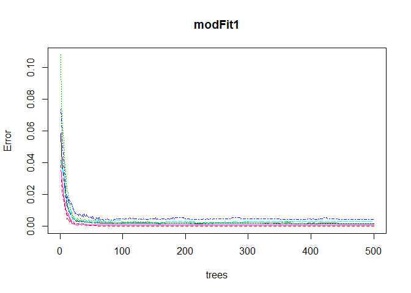

# Practical Machine Learning Assignment
## Executive summary
Analyze the device data from Jawbone Up, Nike FuelBand, and Fitbit for 6 participants, from  their accelerometers on the belt, forearm, arm, and dumbelldata for 5 dataset using linear regression models.  This learning will quantify how much of a particular activity they do, but they rarely quantify how well they do it. 

## Reading the data 
### The Raw Data - Download the file if does not exist in local system

```r
if (!file.exists("./Data/pml-training.csv")){
  download.file("https://d396qusza40orc.cloudfront.net/predmachlearn/pml-training.csv",
                "./Data/pml-training.csv")
}
if (!file.exists("./Data/pml-testing.csv")){
  download.file("https://d396qusza40orc.cloudfront.net/predmachlearn/pml-training.csv",
                "./Data/pml-testing.csv")
}
```

### Load the training and testing data

```r
trainingdata = read.csv("./Data/pml-training.csv", na.strings = c("NA", ""))
dim(trainingdata); summary(trainingdata$classe)
```

```
## [1] 19622   160
```

```
##    A    B    C    D    E 
## 5580 3797 3422 3216 3607
```

```r
testingdata = read.csv("./Data/pml-testing.csv", na.strings = c("NA", ""))
```

### Load the library

```r
library(ggplot2); library(caret);library(randomForest)
```

### Removing near Zero covariates

```r
nzv <- nearZeroVar(trainingdata,saveMetrics=TRUE)
trainingdata <- trainingdata[,nzv$nzv==FALSE]

nzv <- nearZeroVar(testingdata,saveMetrics=TRUE)
testingdata <- testingdata[,nzv$nzv==FALSE]
```

## Partioning the training datset 

```r
inTrain <- createDataPartition(y=trainingdata$classe, p=0.6, list=FALSE)
projTraining <- trainingdata[inTrain, ]; projTesting <- trainingdata[-inTrain, ]
dim(projTraining); dim(projTesting)
```

```
## [1] 11776   117
```

```
## [1] 7846  117
```

### Killing first column of Dataset(ID Removing first ID variable) so that it does not interfer with ML Algorithms. 

```r
projTraining <- projTraining[c(-1)]
```

### Remove the columns / Variables has too many NAs (keep only the variable > 60% threshold of NA's)

```r
subprojTraining <- projTraining 
for(i in 1:length(projTraining)) { 
  if( sum( is.na( projTraining[, i] ) ) /nrow(projTraining) >= .6 ) { 
    for(j in 1:length(subprojTraining)) {
      if( length( grep(names(projTraining[i]), names(subprojTraining)[j]) ) ==1)  { 
        subprojTraining <- subprojTraining[ , -j] 
      }   
    } 
  }
}

projTraining <- subprojTraining
rm(subprojTraining)

clean1 <- colnames(projTraining)
clean2 <- colnames(projTraining[, -58]) # Remove the classe column 
projTesting <- projTesting[clean1]; # set/allow same variabels which are in Training
testing <- testingdata[clean2] # allow same variables which are in training

dim(projTesting); dim(testing)
```

```
## [1] 7846   58
```

```
## [1] 20 57
```

##Coerce the data into the same type

```r
for (i in 1:length(testing) ) {
    for(j in 1:length(projTraining)) {
        if( length( grep(names(projTraining[i]), names(testing)[j]) ) == 1)  {
            class(testing[j]) <- class(projTraining[i])
        }      
    }      
}

# To get the same class between testing and myTraining
testing <- rbind(projTraining[2, -58] , testing)
testing <- testing[-1,]
```

## Model Builinding ~ Train model with random forest due to its highly accuracy rate. 

```r
set.seed(12345)
modFit1 <- randomForest(classe ~. , data=projTraining)
plot(modFit1)
```

 

```r
predict1 <- predict(modFit1, projTesting, type = "class")
confMatrix <- confusionMatrix(predict1, projTesting$classe)
confMatrix 
```

```
## Confusion Matrix and Statistics
## 
##           Reference
## Prediction    A    B    C    D    E
##          A 2232    1    0    0    0
##          B    0 1517    1    0    0
##          C    0    0 1363    7    0
##          D    0    0    4 1276    2
##          E    0    0    0    3 1440
## 
## Overall Statistics
##                                           
##                Accuracy : 0.9977          
##                  95% CI : (0.9964, 0.9986)
##     No Information Rate : 0.2845          
##     P-Value [Acc > NIR] : < 2.2e-16       
##                                           
##                   Kappa : 0.9971          
##  Mcnemar's Test P-Value : NA              
## 
## Statistics by Class:
## 
##                      Class: A Class: B Class: C Class: D Class: E
## Sensitivity            1.0000   0.9993   0.9963   0.9922   0.9986
## Specificity            0.9998   0.9998   0.9989   0.9991   0.9995
## Pos Pred Value         0.9996   0.9993   0.9949   0.9953   0.9979
## Neg Pred Value         1.0000   0.9998   0.9992   0.9985   0.9997
## Prevalence             0.2845   0.1935   0.1744   0.1639   0.1838
## Detection Rate         0.2845   0.1933   0.1737   0.1626   0.1835
## Detection Prevalence   0.2846   0.1935   0.1746   0.1634   0.1839
## Balanced Accuracy      0.9999   0.9996   0.9976   0.9957   0.9991
```
### Let's have a look at the accuracy

```r
confMatrix$overall[1] 
```

```
##  Accuracy 
## 0.9977058
```
### It looks very good, it is more then 99.00%. Random Forests yielded better Results, as expected!

## Predicting Results on the Test Data
###Random Forests gave an Accuracy in the myTesting dataset of 99.7%, which was more accurate than other models. The expected out-of-sample error is 100-99.77 = 0.23%


```r
prediTest <- predict(modFit1, testing, type = "class")
prediTest
```

```
##  2  3 41  5  6  7  8  9 10 11 12 13 14 15 16 17 18 19 20 21 
##  B  A  B  A  A  E  D  B  A  A  B  C  B  A  E  E  A  B  B  B 
## Levels: A B C D E
```
# Write the results to a text file for submission

```r
pml_write_files = function(x){
    n = length(x)
    for(i in 1:n){
        filename = paste0("problem_id_",i,".txt")
        write.table(x[i],file=filename,quote=FALSE,row.names=FALSE,col.names=FALSE)
    }
}
# Write the output for all 20 test cases
pml_write_files(prediTest)
```
# Conclusion
The estimate the out of sample error is less than 1% (1 - accuracy). This is a promising result to detect exercise form to quantify how much of a particular activity they do and effective. 
